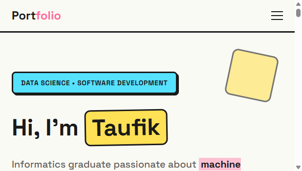
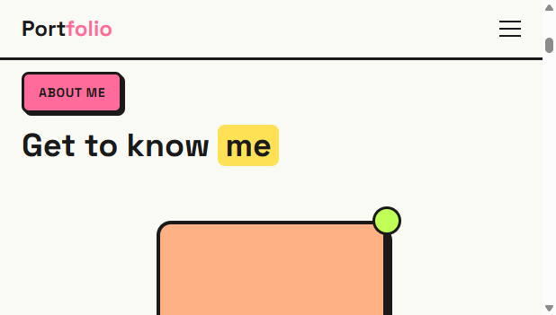
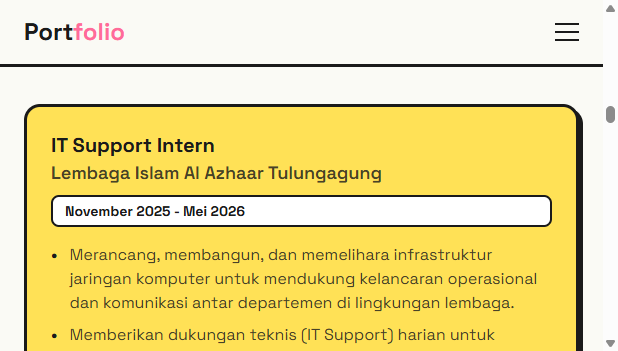
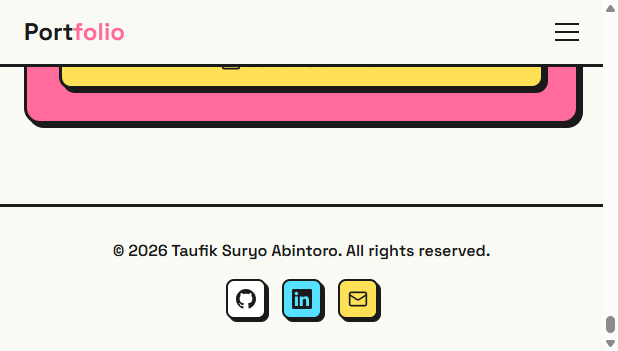

Portofolio pribadi yang modern, responsif, dan didesain dengan indah menggunakan React, TypeScript, Vite, dan Tailwind CSS. Proyek ini berfungsi sebagai etalase komprehensif untuk memamerkan keterampilan, pengalaman kerja, proyek, dan sertifikasi.

## ✨ Fitur

* **Bagian Hero:** Pengantar yang menarik dengan foto profesional dan tombol aksi (call-to-action) yang cepat.
* **Tentang Saya:** Bagian detail yang menyoroti latar belakang, keterampilan, dan perjalanan pribadi.
* **Linimasa Pengalaman:** Linimasa rapi yang menampilkan riwayat pekerjaan dan peran profesional.
* **Galeri Proyek:** Pameran karya terbaru menggunakan tata letak kartu yang responsif.
* **Sertifikasi:** Tampilan grid untuk sertifikat profesional yang telah diraih.
* **Bagian Kontak:** Cara sederhana dan efektif bagi pengunjung untuk menghubungi.
* **Sepenuhnya Responsif:** Dioptimalkan untuk tampilan yang mulus di perangkat desktop maupun seluler.

## 🚀 Teknologi yang Digunakan

* **Framework:** [React 18](https://react.dev/)
* **Bahasa:** [TypeScript](https://www.typescriptlang.org/)
* **Build Tool:** [Vite](https://vitejs.dev/)
* **Styling:** [Tailwind CSS](https://tailwindcss.com/)

## 📸 Tangkapan Layar

Berikut adalah sekilas tentang antarmuka portofolio:

| Bagian Hero | Bagian Tentang |
| :---: | :---: |
|  |  |

| Bagian Pengalaman | Bagian Footer / Bawah |
| :---: | :---: |
|  |  |

## 🛠️ Instalasi & Persiapan

Ikuti petunjuk ini untuk menjalankan proyek secara lokal di komputer Anda.

### Prasyarat
* Node.js (direkomendasikan v18 atau lebih baru)
* npm atau yarn atau pnpm

### Langkah-langkah

1.  **Kloning repositori**
    ```
```text?code_stdout&code_event_index=2
README-v2.md

```bash
    git clone [https://github.com/taufik234/portofolio-1.git](https://github.com/taufik234/portofolio-1.git)
    cd portofolio-1
    ```

2.  **Instal dependensi**
    ```bash
    npm install
    # atau
    yarn install
    ```

3.  **Jalankan server pengembangan**
    ```bash
    npm run dev
    # atau
    yarn dev
    ```

4.  **Buka di Browser**
    Arahkan ke `http://localhost:5173` (atau port yang ditentukan di terminal Anda) pada web browser Anda.

## 📦 Build untuk Produksi

Untuk membuat versi build yang siap untuk produksi:

```bash
npm run build
# atau
yarn build
